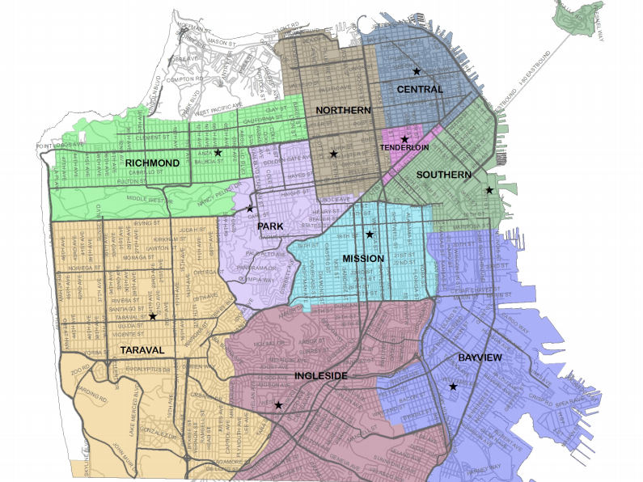

# Kriminalitaet-SF

# GTA San Francisco

Von 1934 bis 1963 war San Francisco bekannt dafür, dass es einige der berüchtigsten Kriminellen der Welt auf der Insel Alcatraz beherbergt hatte. Heute ist die Stadt mehr für ihre Tech-Szene als für ihre kriminelle Vergangenheit bekannt. Aber mit zunehmender Vermögensungleichheit, Wohnungsmangel und der Verbreitung von teurer Unterhaltungselektronik gibt es in der Stadt an der Bucht keinen Mangel an Kriminalität.

Die verwendeten Datensätze stammen von der Plattform <a href="https://www.kaggle.com/c/sf-crime/data"> Kaggle </a> und beinhalten fast 12 Jahre Kriminalitätsberichte aus allen Stadtteilen von San Francisco. Unter Berücksichtigung von Zeit und Ort soll die Kategorie der auftretenden Straftaten vorhersagt werden. Die Daten sind bereits in einen Test- und Trainingsdatensatz aufgeteilt, wobei die Verbrechenskategorie als Feature im Testdatensatz exkludiert wurde. Da ausreichend Daten vorhanden sind, wurde lediglich der Trainingsdatensatz verwendet und die Aufspaltung wird eigenständig durchgeführt. Dadurch kann die Fehlerrate am Schluss bestimmt werden.

    

Die Vorhersagen finden Anwendung in der präventiven Verbrechensbekämpfung. Da Zeit und Ort des nächsten Verbrechens von vorne herein bekannt sind, können die Aktivitäten der Patrouillien auf dieses Gebiet konzentriert werden.

Bei der Aufgabe handelt sich um eine klassische Klassifizierung und wird mit der Methode des überwachten Lernens umgesetzt.
